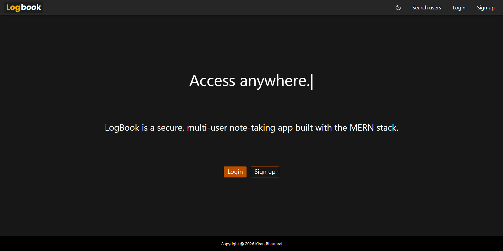
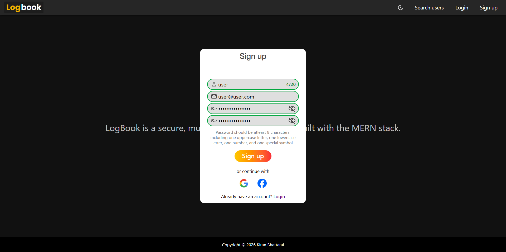
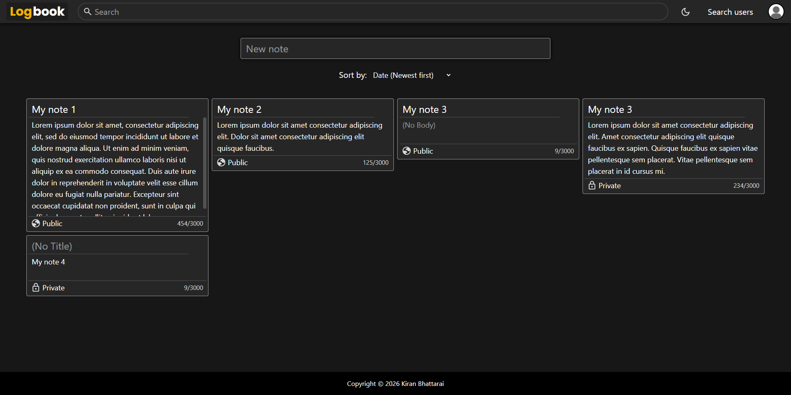
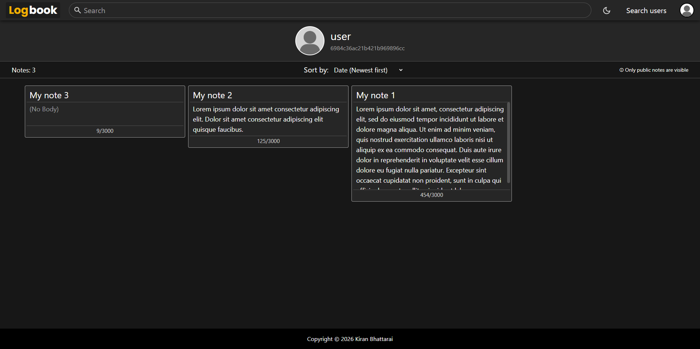
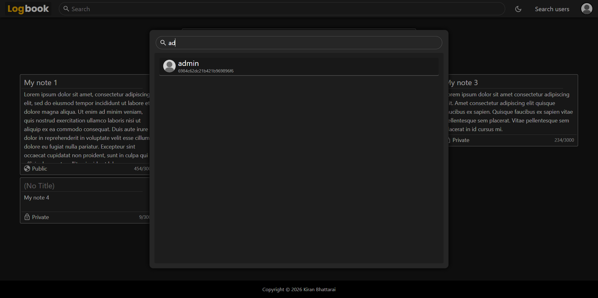
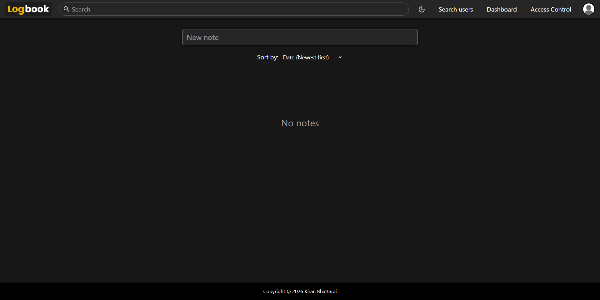

# LogBook

LogBook is a multi-user note-taking full-stack application built with the MERN stack.

### The project is currently on hold. Some features are missing and  will be added in the future.

## Features

- Secure user authentication
- Create, edit and delete your notes
- Data storage using MongoDB
- Admin and user roles
- Public and private notes
- Profiles and user search feature
- Refresh token rotation
- Note search and sort feature

## How to run

1. **Install dependencies**     
Run `npm install` in both the **frontend** and **backend** folders.

2. **Setup environment variables**  
   - Rename the provided `.env.example` files in both frontend and backend folders to `.env`.  
   - Fill in the required values such as `ACCESS_TOKEN_SECRET`, `MONGO_URL`, etc.

3. **Start the backend**        
Navigate to backend folder and run `npm start` on terminal.

4. **Start the frontend**        
Navigate to frontend folder and run `npm run dev` on terminal.

5. **Open the app**     
Open your browser at http://localhost:5173

## Screenshots

