# LogBook

LogBook is a MERN-stack platform featuring private and public notes, user discovery, and a modern UI with adaptive themes. It includes infinite scrolling, full OAuth/email authentication, and a data-driven admin dashboard for user management.

> Deployment link: https://logbook-mauve.vercel.app/

## Features

### Authentication & Security
- Local login/signup with email verification
- OAuth login via Google & Facebook
- Password reset with expiring codes
- Role-based access (User/Admin)
- Rate limiting using Redis
- Logging using Winston
- Automatic admin assignment to first user

### Notes
- Create, read, update, and delete public/private notes
- Search your notes and view other users’ public notes

### Profiles & Customization
- Custom profile pictures via Cloudinary
- Search and view other users’ profiles
- Dark/light mode with system detection and manual toggle

### Admin Dashboard
- View users and notes statistics with charts
- Manage users: rename, remove profile pictures, promote/demote, or delete

### Frontend Experience
- Smooth UI with loading skeletons
- Infinite scrolling with TanStack Query

## How to run locally

1. **Install dependencies**     
Run `npm install` in both the **frontend** and **backend** folders.

2. **Setup environment variables**  
   - Rename the provided `.env.example` files in both frontend and backend folders to `.env`.  
   - Fill in the required values such as `ACCESS_TOKEN_SECRET`, `MONGO_URL`, etc.

3. **Start the backend**        
Navigate to backend folder and run `npm start` on terminal.

4. **Start the frontend**        
Navigate to frontend folder and run `npm run dev` on terminal.

5. **Open the app**     
Open your browser at http://localhost:5173

## Screenshots

  <!-- Row 1: Access Control -->
  

    

      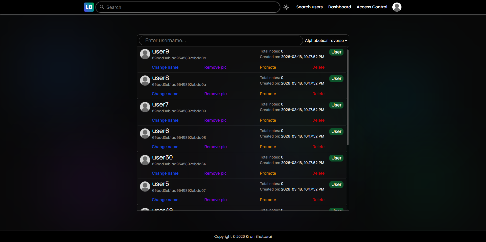
      
Dark Mode - Access Control

    

    

      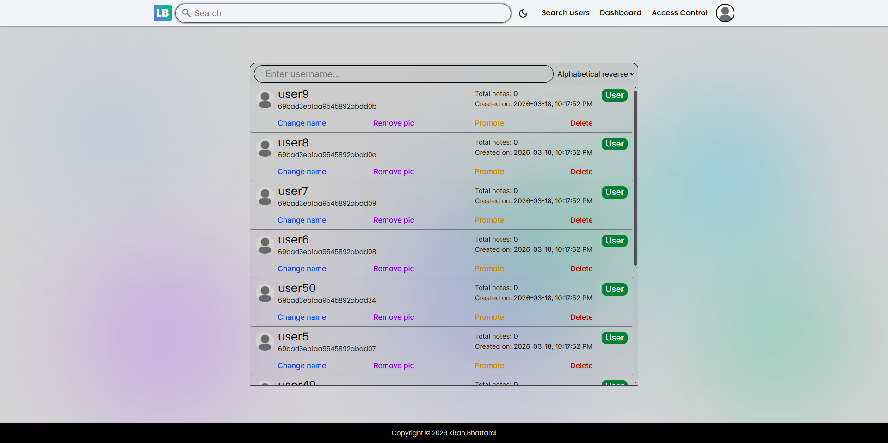
      
Light Mode - Access Control

    

  

  <!-- Row 2: Avatar Change -->
  

    

      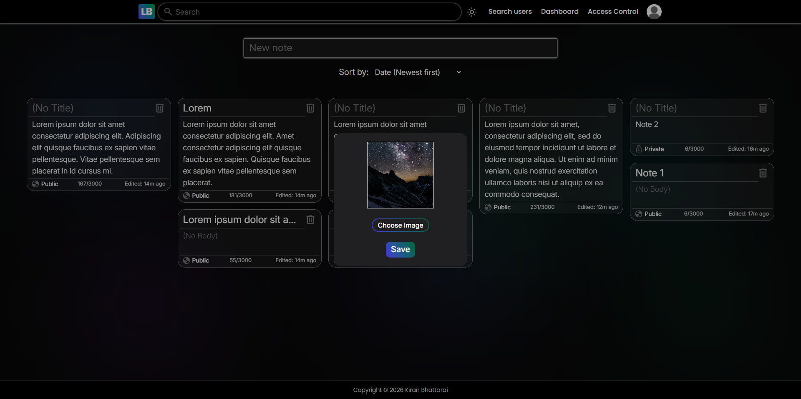
      
Dark Mode - Avatar Change

    

    

      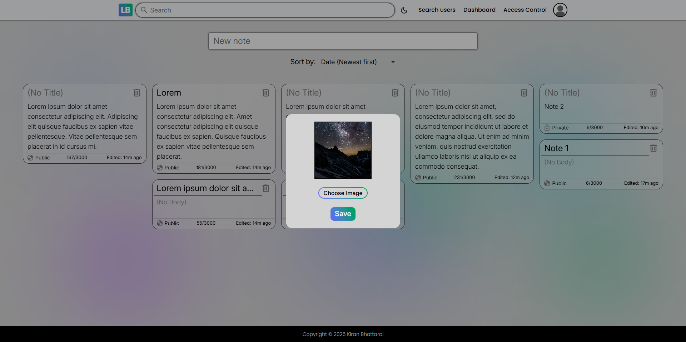
      
Light Mode - Avatar Change

    

  

  <!-- Row 3: Dashboard -->
  

    

      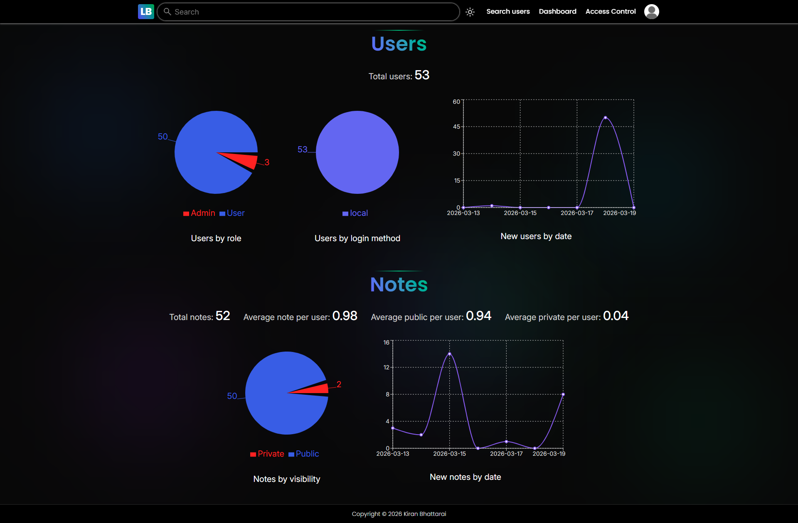
      
Dark Mode - Dashboard

    

    

      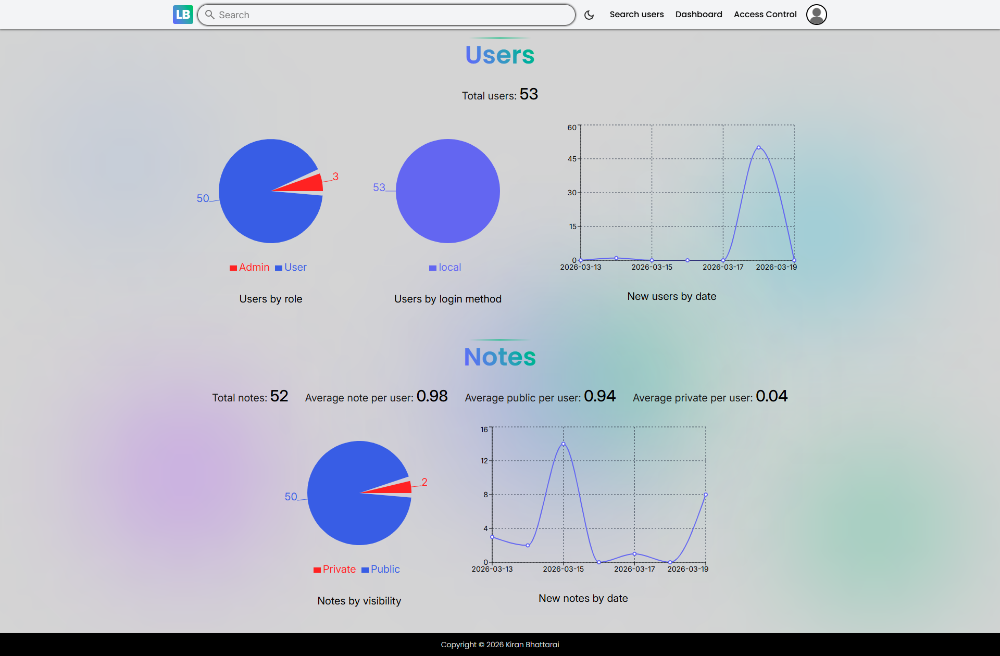
      
Light Mode - Dashboard

    

  

  <!-- Row 4: Edit Note -->
  

    

      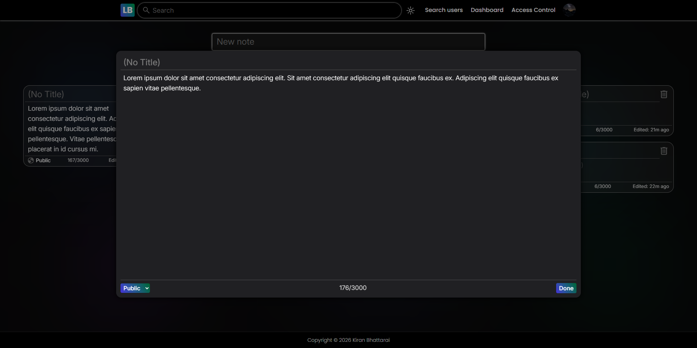
      
Dark Mode - Edit Note

    

    

      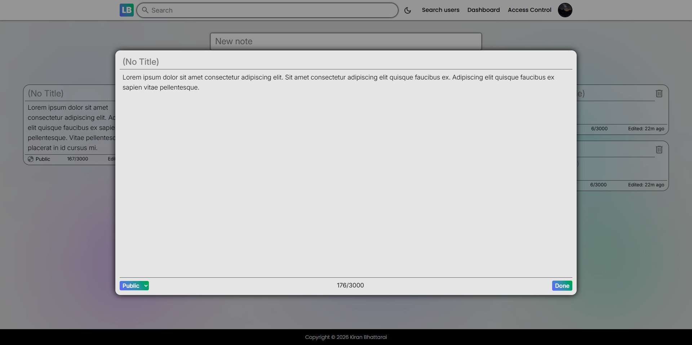
      
Light Mode - Edit Note

    

  

  <!-- Row 5: Homepage -->
  

    

      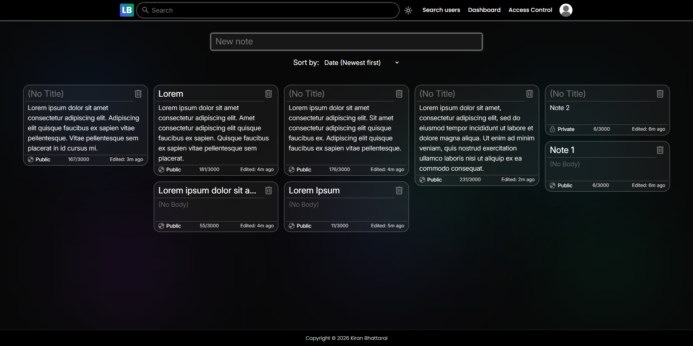
      
Dark Mode - Homepage

    

    

      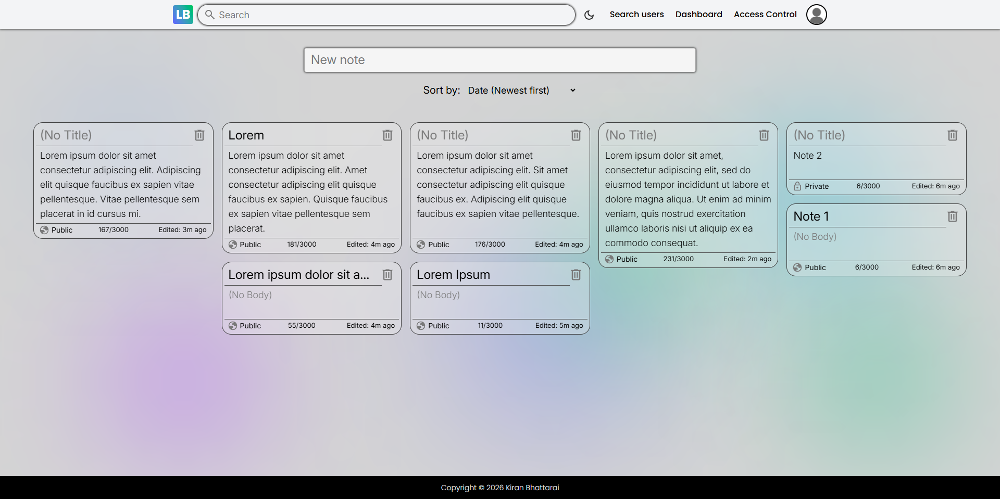
      
Light Mode - Homepage

    

  

  <!-- Row 6: Profile -->
  

    

      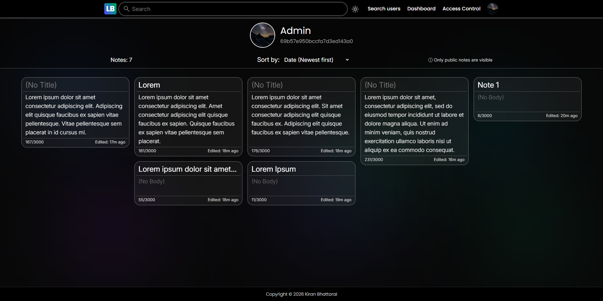
      
Dark Mode - Profile

    

    

      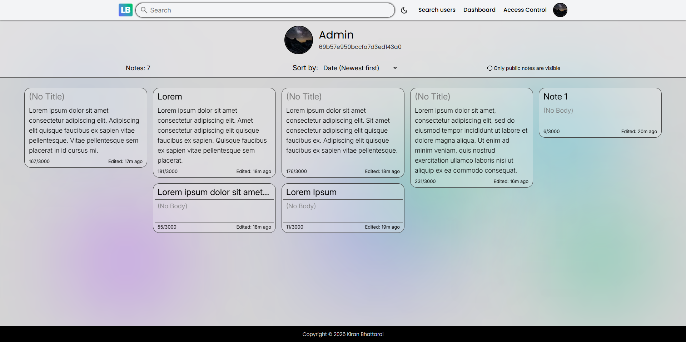
      
Light Mode - Profile

    

  

  <!-- Row 7: Reset Password -->
  

    

      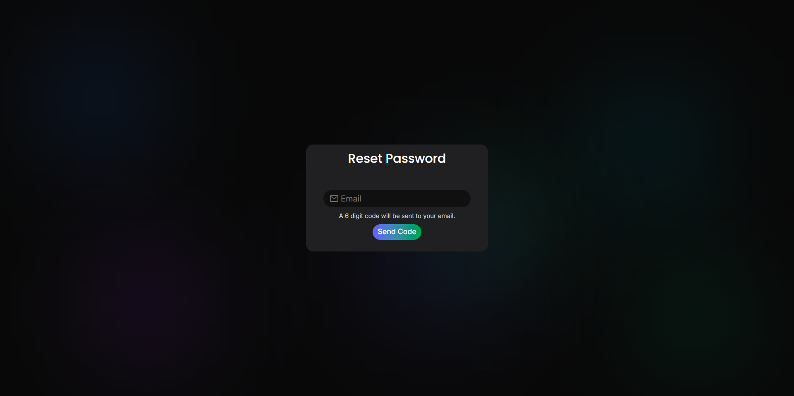
      
Dark Mode - Reset Password

    

    

      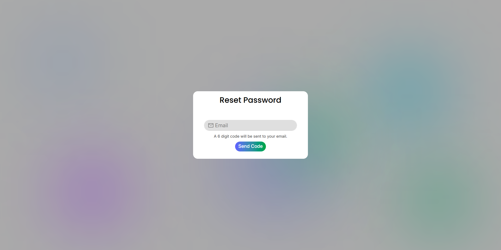
      
Light Mode - Reset Password

    

  

  <!-- Row 8: Search -->
  

    

      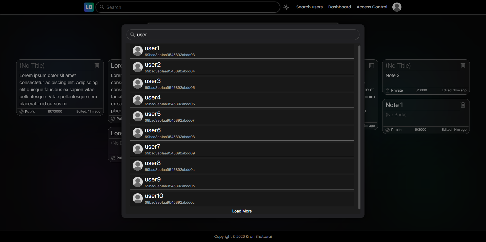
      
Dark Mode - Search

    

    

      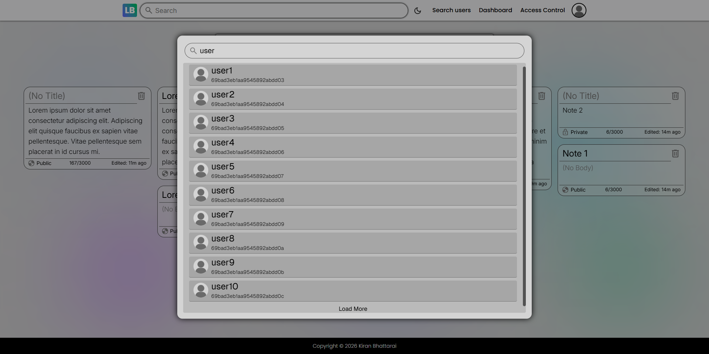
      
Light Mode - Search

    

  

  <!-- Row 9: Unauthenticated -->
  

    

      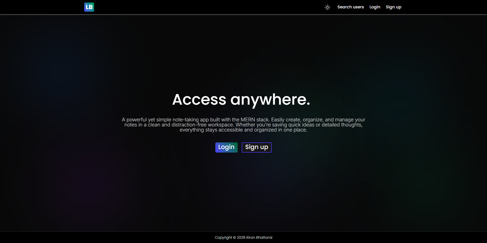
      
Dark Mode - Unauthenticated

    

    

      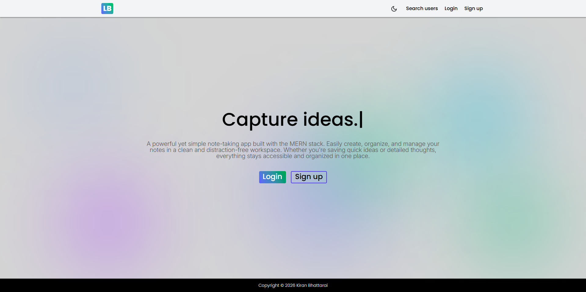
      
Light Mode - Unauthenticated

    

  

